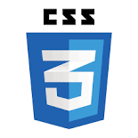
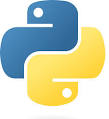

## About Me 🚀

### Hi there, I'm Seng Wei Han 👋

I recently graduated from Monash University Malaysia with a degree in Computer Science, and I'm extremely enthusiastic about web development🐱‍🚀🐱‍🚀. I have a passion for creating intuitive and visually appealing web applications that provide seamless user experiences. With a strong foundation in programming and problem-solving, I am constantly exploring new technologies and frameworks to stay updated with the latest trends in the industry.

I believe in the power of collaboration and continuous learning💪💪, and I'm always excited to work with like-minded individuals who share the same passion for web development. I am eager to contribute to innovative projects and further enhance my skills while making a meaningful impact.

If you have any exciting web development opportunities or if you'd like to connect, feel free to reach out. Let's create amazing web experiences together!🙌🙌

## Skills
  

## Contact
LinkedIn: https://www.linkedin.com/in/seng-wei-han-733409209/ 
